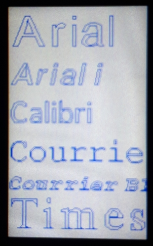

# Vector-fonts-for-ST7789-display
Some vector fonts usable in Micropython on a ST7789 display

The Python file (`Test_vector.py`) enables to display some texts using the fonts in the `Fonts` directory.

All fonts in the directory `vector_fonts` can also be used.

This was tested on a Lyligo T-Pico C3 device.
